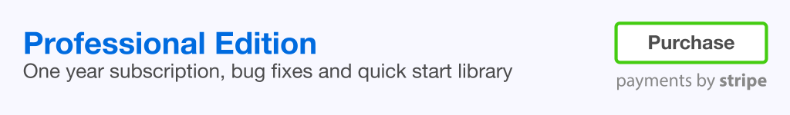
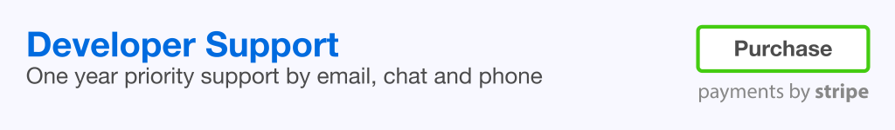

Cat State Detector
==================

This repo demonstrates how you can sell products and services directly from your
GitHub account using **[freshbits](https://freshbits.io)**. For this example,
we've built a special Cat State Detector :smiley_cat:. With this incredible
library you'll be able to tell whether your cat:

* Is alive or dead
* Wants to play with you or test your resolve
* Wants to go outside or force you to hold the door open

### Professional Edition & Developer Support

Like what you see? Buy our **[professional edition](https://freshbits.io/example/cat-state-detector-pro)** and get one year
of updates and enhancements! Get more features and
access to our library of more than 50 extensions:

* AI meme generator adds funny captions to your cat photos automatically
* Cat-blaster cross-posts automatically to every social network you've ever signed up for
* And much more ...

Save time and money by purchasing one year of **[professional support](https://freshbits.io/example/cat-state-detector-pro/support)**.

* Priority chat, email and phone support
* Starter templates and advanced examples
* Bug fixes

Community support is available for free through our [Gitter](https://gitter.io)
and [Google Groups](https://groups.google.com) channels. We do not monitor
these channels, nor do we warranty the correctness of information provided
within these venues.

-------------------------------------------------------------------------------

## Documentation

This section is just for decoration. If this was a real project, you'd see
detailed instructions here on how to build, run and deploy the product.

* [Dependencies]()
* [Installation]()
* [Deployment]()
* [Virtualenv]()
* [Build & Run]()

### Dependencies

Lorem ipsum dolor sit amet, consectetur adipiscing elit. Praesent lobortis tempor convallis. Nunc quis dui ornare, maximus metus non, accumsan turpis. Cras ultrices ac justo in pretium. Aenean ultricies pulvinar vehicula. Aliquam porta luctus dui. Nam tristique feugiat rhoncus. Aliquam est lectus, finibus faucibus porta et, cursus quis erat. Curabitur est purus, vehicula at imperdiet vitae, ultrices vitae enim. Aliquam nec turpis nec erat sollicitudin luctus sed a nisi. Maecenas viverra consectetur leo, eget pellentesque est lacinia a. Class aptent taciti sociosqu ad litora torquent per conubia nostra, per inceptos himenaeos. Morbi rutrum justo sed pulvinar pulvinar. Praesent fringilla euismod eros in laoreet.

### Installation

Lorem ipsum dolor sit amet, consectetur adipiscing elit. Praesent lobortis tempor convallis. Nunc quis dui ornare, maximus metus non, accumsan turpis. Cras ultrices ac justo in pretium. Aenean ultricies pulvinar vehicula. Aliquam porta luctus dui. Nam tristique feugiat rhoncus. Aliquam est lectus, finibus faucibus porta et, cursus quis erat. Curabitur est purus, vehicula at imperdiet vitae, ultrices vitae enim. Aliquam nec turpis nec erat sollicitudin luctus sed a nisi. Maecenas viverra consectetur leo, eget pellentesque est lacinia a. Class aptent taciti sociosqu ad litora torquent per conubia nostra, per inceptos himenaeos. Morbi rutrum justo sed pulvinar pulvinar. Praesent fringilla euismod eros in laoreet.

### Deployment

Lorem ipsum dolor sit amet, consectetur adipiscing elit. Praesent lobortis tempor convallis. Nunc quis dui ornare, maximus metus non, accumsan turpis. Cras ultrices ac justo in pretium. Aenean ultricies pulvinar vehicula. Aliquam porta luctus dui. Nam tristique feugiat rhoncus. Aliquam est lectus, finibus faucibus porta et, cursus quis erat. Curabitur est purus, vehicula at imperdiet vitae, ultrices vitae enim. Aliquam nec turpis nec erat sollicitudin luctus sed a nisi. Maecenas viverra consectetur leo, eget pellentesque est lacinia a. Class aptent taciti sociosqu ad litora torquent per conubia nostra, per inceptos himenaeos. Morbi rutrum justo sed pulvinar pulvinar. Praesent fringilla euismod eros in laoreet.

    docker pull elmarquez/cat-state-detector

Lorem ipsum dolor sit amet, consectetur adipiscing elit. Praesent lobortis tempor convallis:

    docker run -p 54717:8888 -t -i elmarquez/cat-state-detector

Lorem ipsum dolor sit amet, consectetur adipiscing elit.

    http://localhost:54717

Lorem ipsum dolor sit amet, consectetur adipiscing elit. Praesent lobortis tempor convallis.

### Virtualenv

Lorem ipsum dolor sit amet, consectetur adipiscing elit. Praesent lobortis tempor convallis. Nunc quis dui ornare, maximus metus non, accumsan turpis. Cras ultrices ac justo in pretium. Aenean ultricies pulvinar vehicula. Aliquam porta luctus dui.
Run the following commands:

    sudo apt-get install python-opencv python-setuptools python-pip gfortran g++ liblapack-dev libsdl1.2-dev libsmpeg-dev mercurial
    sudo pip install virtualenv
    virtualenv venv
    cd venv
    mkdir src
    ln -s /usr/local/lib/python2.7/dist-packages/cv2.so lib/python2.7/site-packages/cv2.so
    ln -s /usr/local/lib/python2.7/dist-packages/cv.py lib/python2.7/site-packages/cv.py
    ./bin/pip install -r requirements.txt
    ./bin/pip install https://github.com/elmarquez/cat-state-detector/develop

### Build & Run

Lorem ipsum dolor sit amet, consectetur adipiscing elit. Praesent lobortis tempor convallis. Nunc quis dui ornare, maximus metus non, accumsan turpis. Cras ultrices ac justo in pretium. Aenean ultricies pulvinar vehicula. Aliquam porta luctus dui.

    python wtfcat.py

Lorem ipsum dolor sit amet, consectetur adipiscing elit. Praesent lobortis tempor convallis. Nunc quis dui ornare, maximus metus non, accumsan turpis. Cras ultrices ac justo in pretium.

### Copyrights

Cat State Detector is Copyright (c) 2020 Example Corporation. All rights reserved.

:sparkles:
