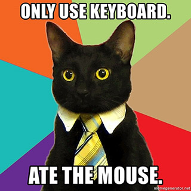

Cat State Detector
==================

This repo demonstrates how you can sell products and services directly from your
GitHub account using **[freshbits](https://freshbits.io)**. For this example,
we've built a special Cat State Detector :smiley_cat:. With this incredible
library you'll be able to tell whether your cat:

* Is alive or dead
* Wants to go outside or just force you to hold the door open
* Wants you to pet it or is just teasing you

## Build & Run

Cat State Detector was written in [Python](http://python.org/). To run the
application, execute the following at a terminal:

    python wtfcat.py

Make sure you have a recent version installed. If not, don't worry about it.
You just need to read this README anyway.

## Professional Extensions & Support

Like what you see? Get more features with our professional extensions:

* AI meme generator adds funny captions to your cat photos automatically
* Cat-blaster cross-posts automatically to every social network on the planet
* And more ...

Save time and money by purchasing one year of professional support.

* Priority chat, email and phone support
* Starter templates and advanced examples
* Bug fixes

Learn more about [freshbits](https://freshbits.io)

## Copyrights

Cat State Detector is Copyright (c) 2020 Example Corporation. All rights reserved.

:sparkles:
