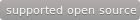

Cat State Detector
==================

This repo demonstrates how you can sell products and services directly from your
GitHub account using **[freshbits](https://freshbits.io)**. For this example,
we've built a special Cat State Detector :smiley_cat:. With this incredible
library you'll be able to tell whether your cat:

* Is alive or dead
* Wants to go outside or just force you to hold the door open

## Professional Edition & Support Services

Like what you see? Buy our **[professional edition](https://freshbits.io/example/cat-state-detector-pro)**! Get more features and
access to our library of more than 50 extensions:

* AI meme generator adds funny captions to your cat photos automatically
* Cat-blaster cross-posts automatically to every social network you've ever signed up for
* And much more ...

Save time and money by purchasing one year of **[professional support](https://freshbits.io/example/cat-state-detector-pro/support)**.

* Priority chat, email and phone support
* Starter templates and advanced examples
* Bug fixes

Community support is available for free through our [Gitter](https://gitter.io)
and [Google Groups](https://groups.google.com) channels. We do not monitor
these channels, nor do we warranty the correctness of information provided
within these venues.

## Documentation

### Build & Run

Cat State Detector was written in [Python](http://python.org/). To run the
application, execute the following at a terminal:

    python wtfcat.py

Make sure you have a recent version installed. If not, don't worry about it.
You just need to read this README anyway.

### Copyrights

Cat State Detector is Copyright (c) 2020 Example Corporation. All rights reserved.

:sparkles:
